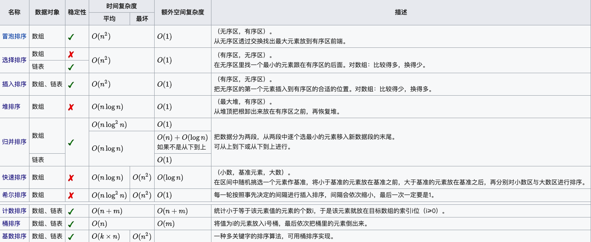
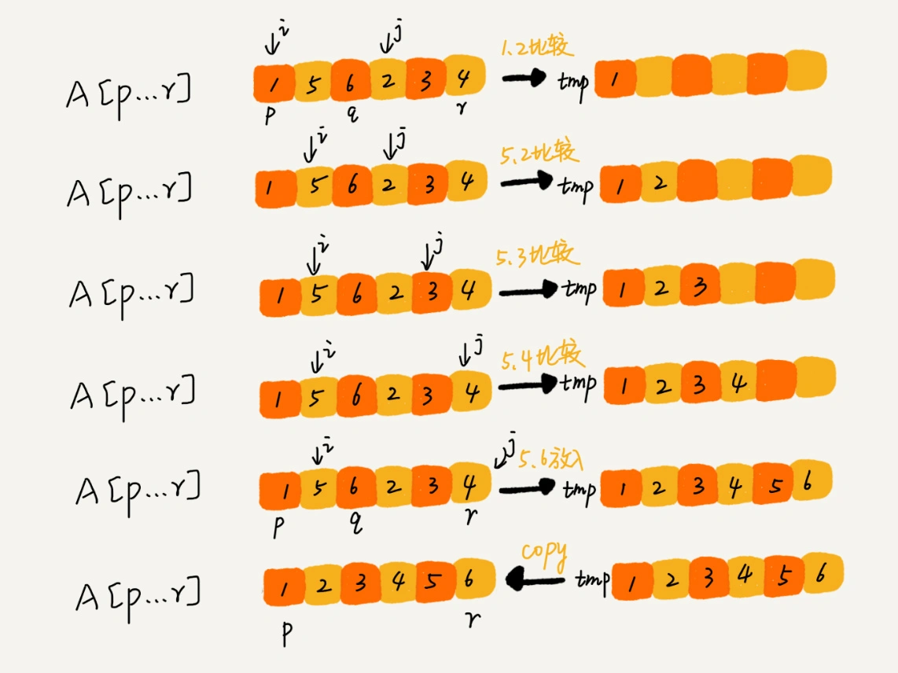

[TOC]

## 排序算法概览

- n：数据规模
- k："桶"的个数
- In-place：占用常数内存，不占用额外内存
- Out-place：占用额外内存
- 稳定性：排序后 2 个相等键值的顺序和排序之前它们的顺序相同

## 排序算法

### 冒泡排序(Bubble Sort)
冒泡排序只会操作相邻的两个数据。每次冒泡操作都会对相邻的两个元素进行比较，看是否满足大小关系要求。如果不满足就让它俩互换。

### 插入排序(Insertion Sort)
插入排序可以将数组中的数据分为已排序区间和未排序区间. 将第一待排序序列第一个元素看做一个有序序列，把第二个元素到最后一个元素当成是未排序序列。从头到尾依次扫描未排序序列，将扫描到的每个元素插入有序序列的适当位置，保证已排序区间数据一直有序。
(如果待插入的元素与有序序列中的某个元素相等，则将待插入元素插入到相等元素的后面。) 重复这个过程，直到未排序区间中元素为空，算法结束。

### 希尔排序(Shell Sort)-插入排序的优化

### 选择排序(Selection Sort)
选择排序也分已排序区间和未排序区间,每次会从未排序区间中找到最小的元素,将其放到已排序区间的末尾.
无论什么数据进去都是 O(n²) 的时间复杂度.唯一的好处可能就是不占用额外的内存空间.
算法步骤:

* 首先在未排序序列中找到最小(大)元素，存放到排序序列的起始位置;
* 再从剩余未排序元素中继续寻找最小(大)元素，然后放到已排序序列的末尾.
* 重复第二步，直到所有元素均排序完毕。

### 归并排序(Merge Sort)
归并排序利用的是分治的思想, 分治，顾名思义，就是分而治之，将一个大问题分解成小的子问题来解决。小的子问题解决了，大问题也就解决了。

分治算法一般都是用递归来实现的。分治是一种解决问题的处理思想，递归是一种编程技巧。

归并排序的步骤:
- 申请一个临时数组 tmp，大小与 A[p...r]相同。
- 用两个游标 i 和 j，分别指向 A[p...q]和 A[q+1...r]的第一个元素。
- 比较这两个元素 A[i]和 A[j]，如果 A[i]<=A[j]，就把 A[i]放入到临时数组 tmp，并且 i 后移一位，否则将 A[j]放入到数组 tmp，j 后移一位。
- 继续上述比较过程，直到其中一个子数组中的所有数据都放入临时数组中，再把另一个数组中的数据依次加入到临时数组的末尾，这个时候，临时数组中存储的就是两个子数组合并之后的结果了。
- 最后再把临时数组 tmp 中的数据拷贝到原数组 A[p...r]中。

如图所示:

动态图如图所示:

### 快速排序(Quick Sort)
快排利用的也是分治的思想.

快排的思想是这样的：
- 如果要排序数组中下标从 p 到 r 之间的一组数据，我们选择 p 到 r 之间的任意一个数据作为 pivot（分区点）。
- 遍历 p 到 r 之间的数据，将小于 pivot 的放到左边，将大于 pivot 的放到右边，将 pivot 放到中间。
- 数组 p 到 r 之间的数据就被分成了三个部分，前面 p 到 q-1 之间都是小于 pivot 的，中间是 pivot，后面的 q+1 到 r 之间是大于 pivot 的。
- 根据分治、递归的处理思想，用递归排序下标从 p 到 q-1 之间的数据和下标从 q+1 到 r 之间的数据，直到区间缩小为 1，就说明所有的数据都有序了。

## 参考文章:

- https://en.wikipedia.org/wiki/Sorting_algorithm
- https://zh.wikipedia.org/wiki/%E6%8E%92%E5%BA%8F%E7%AE%97%E6%B3%95
- https://www.runoob.com/w3cnote/ten-sorting-algorithm.html
- https://time.geekbang.org/column/article/41802
