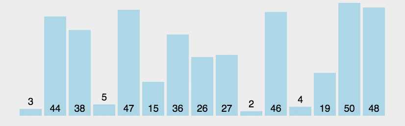

[TOC]

## 排序算法概览

- n：数据规模
- k："桶"的个数
- In-place：占用常数内存，不占用额外内存
- Out-place：占用额外内存
- 稳定性：排序后 2 个相等键值的顺序和排序之前它们的顺序相同

## 排序算法

### 冒泡排序(Bubble Sort)
冒泡排序只会操作相邻的两个数据。每次冒泡操作都会对相邻的两个元素进行比较，看是否满足大小关系要求。如果不满足就让它俩互换。

### 插入排序(Insertion Sort)
插入排序可以将数组中的数据分为已排序区间和未排序区间. 将第一待排序序列第一个元素看做一个有序序列，把第二个元素到最后一个元素当成是未排序序列。从头到尾依次扫描未排序序列，将扫描到的每个元素插入有序序列的适当位置，保证已排序区间数据一直有序。
(如果待插入的元素与有序序列中的某个元素相等，则将待插入元素插入到相等元素的后面。) 重复这个过程，直到未排序区间中元素为空，算法结束。

### 希尔排序(Shell Sort)-插入排序的优化

### 选择排序(Selection Sort)
选择排序也分已排序区间和未排序区间,每次会从未排序区间中找到最小的元素,将其放到已排序区间的末尾.
无论什么数据进去都是 O(n²) 的时间复杂度.唯一的好处可能就是不占用额外的内存空间.
算法步骤:

* 首先在未排序序列中找到最小(大)元素，存放到排序序列的起始位置;
* 再从剩余未排序元素中继续寻找最小(大)元素，然后放到已排序序列的末尾.
* 重复第二步，直到所有元素均排序完毕。

### 归并排序(Merge Sort)
归并排序利用的是分治的思想, 分治，顾名思义，就是分而治之，将一个大问题分解成小的子问题来解决。小的子问题解决了，大问题也就解决了。

分治算法一般都是用递归来实现的。分治是一种解决问题的处理思想，递归是一种编程技巧。

归并排序的步骤:
- 申请一个临时数组 tmp，大小与 A[p...r]相同。
- 用两个游标 i 和 j，分别指向 A[p...q]和 A[q+1...r]的第一个元素。
- 比较这两个元素 A[i]和 A[j]，如果 A[i]<=A[j]，就把 A[i]放入到临时数组 tmp，并且 i 后移一位，否则将 A[j]放入到数组 tmp，j 后移一位。
- 继续上述比较过程，直到其中一个子数组中的所有数据都放入临时数组中，再把另一个数组中的数据依次加入到临时数组的末尾，这个时候，临时数组中存储的就是两个子数组合并之后的结果了。
- 最后再把临时数组 tmp 中的数据拷贝到原数组 A[p...r]中。

如图所示:

动态图如图所示:

### 快速排序(Quick Sort)
快排利用的也是分治的思想.

快排的思想是这样的：
- 如果要排序数组中下标从 p 到 r 之间的一组数据，我们选择 p 到 r 之间的任意一个数据作为 pivot（分区点）。
- 遍历 p 到 r 之间的数据，将小于 pivot 的放到左边，将大于 pivot 的放到右边，将 pivot 放到中间。
- 数组 p 到 r 之间的数据就被分成了三个部分，前面 p 到 q-1 之间都是小于 pivot 的，中间是 pivot，后面的 q+1 到 r 之间是大于 pivot 的。
- 根据分治、递归的处理思想，用递归排序下标从 p 到 q-1 之间的数据和下标从 q+1 到 r 之间的数据，直到区间缩小为 1，就说明所有的数据都有序了。

总结一下就是:
- 从数列中挑出一个元素，称为 "基准"（pivot）;
- 重新排序数列，所有元素比基准值小的摆放在基准前面，所有元素比基准值大的摆在基准的后面（相同的数可以到任一边）。在这个分区退出之后，该基准就处于数列的中间位置。这个称为分区（partition）操作；
- 递归地把小于基准值元素的子数列和大于基准值元素的子数列排序；

归并排序和快速排序是两种稍微复杂的排序算法，它们用的都是分治的思想，代码都通过递归来实现，过程非常相似。

理解归并排序的重点是理解递推公式和 merge() 合并函数。理解快排的重点也是理解递推公式，还有 partition() 分区函数。归并排序的处理过程是由下到上的，先处理子问题，然后再合并。而快排正好相反，它的处理过程是由上到下的，先分区，然后再处理子问题。

归并排序算法是一种在任何情况下时间复杂度都比较稳定的排序算法，这也使它存在致命的缺点，即归并排序不是原地排序算法，空间复杂度比较高，是 O(n)。正因为此，它也没有快排应用广泛。快速排序解决了归并排序占用太多内存的问题。

快速排序算法虽然最坏情况下的时间复杂度是 O(n^2)，但是平均情况下时间复杂度都是 O(nlogn)。不仅如此，快速排序算法时间复杂度退化到 O(n^2) 的概率非常小，我们可以通过合理地选择 pivot 来避免这种情况。

### 桶排序(Bucket Sort)

### 计数排序(Counting Sort)

## 关于排序的几个思考题
1.现在你有 10 个接口访问日志文件，每个日志文件大小约 300MB，每个文件里的日志都是按照时间戳从小到大排序的。你希望将这 10 个较小的日志文件，合并为 1 个日志文件，合并之后的日志仍然按照时间戳从小到大排列。如果处理上述排序任务的机器内存只有 1GB，你有什么好的解决思路，能“快速”地将这 10 个日志文件合并吗？

- 思路: 先构建十条io流，分别指向十个文件，每条io流读取对应文件的第一条数据，然后比较时间戳，选择出时间戳最小的那条数据，将其写入一个新的文件，然后指向该时间戳的io流读取下一行数据，然后继续刚才的操作，比较选出最小的时间戳数据，写入新文件，io流读取下一行数据，以此类推，完成文件的合并， 这种处理方式，日志文件有n个数据就要比较n次，每次比较选出一条数据来写入，时间复杂度是O（n），空间复杂度是O（1）,几乎不占用内存.

2.有 10GB 的订单数据，我们希望按订单金额（假设金额都是正整数）进行排序，但是我们的内存有限，只有几百 MB，没办法一次性把 10GB 的数据都加载到内存中。这个时候该怎么办呢？

- 思路: 借助桶排序的处理思想来解决这个问题。 先扫描一遍文件，看订单金额所处的数据范围。假设经过扫描之后我们得到，订单金额最小是 1 元，最大是 10 万元。我们将所有订单根据金额划分到 n 个桶里，并且按照金额范围的大小顺序编号命名（00，01，02...99，...）。金额从1到10万可能不是均匀分布的，有可能某个金额区间的数据特别多，划分之后对应的文件就会很大，没法一次性读入内存。针对这些划分之后还是比较大的文件，我们可以继续划分，直到所有的文件都能读入内存为止。

3.高考查分数系统，我们查分数的时候，系统会显示我们的成绩以及所在省的排名。如果你所在的省有 50 万考生，如何通过成绩快速排序得出名次呢？

- 思路: 

4.假设有 10 万个手机号码，希望将这 10 万个手机号码从小到大排序

## 参考文章:
- https://en.wikipedia.org/wiki/Sorting_algorithm
- https://zh.wikipedia.org/wiki/%E6%8E%92%E5%BA%8F%E7%AE%97%E6%B3%95
- https://www.runoob.com/w3cnote/ten-sorting-algorithm.html
- https://time.geekbang.org/column/article/41802
