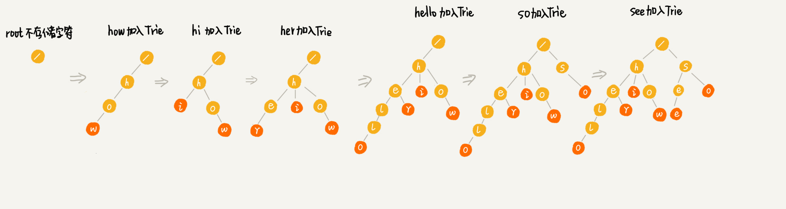

[TOC]

# Trie Tree

## 1.什么是 Trie Tree?
Trie Tree,("trie" 读音同 "try")又称"字典树"、"前缀树".它是一个树形结构,它是一种专门处理字符串匹配的数据结构,用来解决在一组字符串集合中快速查找某个字符串的问题.

使用场景:
搜索引擎的搜索关键词提示功能,当我们在搜索引擎的搜索框中,输入要搜索的文字的某一部分的时候,搜索引擎就会自动弹出下拉框,里面是各种关键词提示.
像 Google、百度这样的搜索引擎,它们的关键词提示功能非常全面和精准,肯定做了很多优化.底层最基本的原理就是Trie Tree.

**Trie Tree的本质是利用字符串之间的公共前缀,将重复的前缀合并在一起.**

举个例子:
有6个字符串:how,hi,her,hello,so,see. 要从里面多次查找某个字符串是否存在.如果每次查找都是拿要找的字符串跟这几个字符串依次进行匹配,那效率就会比较低.更高效的方法是:先对这6个字符串做一个预处理,组织成Trie Tree的结构,之后每次查找都在Trie Tree中进行匹配.

首先看下这6个字符串构造出来的Trie Tree是什么样子的:


这个Trie Tree的构造过程如下:


比如说要查找"her",那么我们可以将要查找的字符串分割成"h","e","r".然后从 Trie 树的根节点开始匹配.

匹配路径:"/ -> h -> e -> r".


如果要查找的是"he",方法和上面一样,先把字符串分割成"h","e",从根节点开始,沿着某条路径来匹配,

路径是:"/ -> h -> e",但是路径后面还有节点,说明:"he"是某个字符串的前缀子串,但是并不能完全匹配任何字符串.

## 2.如何实现 Trie Tree?

从上面的流程分析来看,Trie Tree 主要有两个操作:

(1)将字符串集合构造成 Trie Tree, 可以理解为将一个字符串插入到 Trie Tree 的过程;

(2)在 Trie Tree中查询一个字符串.

首先看一下如何存储一个 Trie Tree.

Trie 是多叉树的结构,即每个节点的分支数量可能为多个.但是 Trie 树和一般的多叉树不一样,尤其在节点的数据结构设计上,比如一般的多叉树的节点是这样的:

```java
public class TreeNode {
    char value;                              // 节点值
    TreeNode[] children = new TreeNode[NUM]; // 指向孩子节点
}
```

而 Trie 树的节点是这样的:

```java
public class TrieNode {
    boolean isEnd;                          // 该结点是否是一个串的结束
    TrieNode[] children = new TrieNode[26]; // 字母映射表
}
```

假设我们的字符串中只有从 a 到 z 这 26 个小写字母,我们在数组中下标为 0 的位置,存储指向子节点 a 的指针,下标为 1 的位置存储指向子节点 b 的指针,以此类推,下标为 25 的位置,存储的是指向的子节点 z 的指针.  如果某个字符的子节点不存在,我们就在对应的下标的位置存储 null.

所以如果需要迅速找到匹配的子节点的指针,可以通过字符的ASCII码减 "a" 的ASCII码.

例子中的 Trie Tree 数据结构可以用下图直观展示:


代码实现:[Trie.java](Trie.java)

查找某个字符串的时间复杂度: O(n)

### 3. Trie Tree性能消耗分析

Trie Tree 是一种独特的高效的字符串匹配方法. 但是, Trie Tree 是非常耗内存的,用的是一种空间换时间的思路.

如果字符串中包含从 a 到 z 这 26 个字符,那每个节点都要存储一个长度为 26 的数组,并且每个数组元素要存储一个 8 字节指针(或者是 4 字节,这个大小跟 CPU、操作系统、编译器等有关). 而且,即便一个节点只有很少的子节点,远小于 26 个,比如 3、4 个,我们也要维护一个长度为 26 的数组.

如果字符串中不仅包含小写字母,还包含大写字母、数字、甚至是中文,那需要的存储空间就更多了.所以,也就是说,在某些情况下,Trie 树不一定会节省存储空间,可能会浪费更多的内存.

Trie 树尽管有可能很浪费内存,但是确实非常高效. 如何解决内存的问题?

将每个节点中的数组换成其他数据结构来存储一个节点的子节点指针,比如有序数组、跳表、散列表、红黑树等.

假设换成有序数组,数组中的指针按照所指向的字符的大小顺序排序.查询时,我们可以通过二分查找的方法.但是,在往 Trie Tree 插入一个字符串的时候,我们需要维护数组中数据的有序性,会消耗一些时间.

Trie 树的变体有很多,都可以在一定程度上解决内存消耗的问题.


参考:
* [《极客时间》-《数据结构与算法之美》](https://time.geekbang.org/column/article/72414)
* [ LeetCode - Trie Tree 的实现(适合初学者)](https://leetcode-cn.com/problems/implement-trie-prefix-tree/solution/trie-tree-de-shi-xian-gua-he-chu-xue-zhe-by-huwt/)
